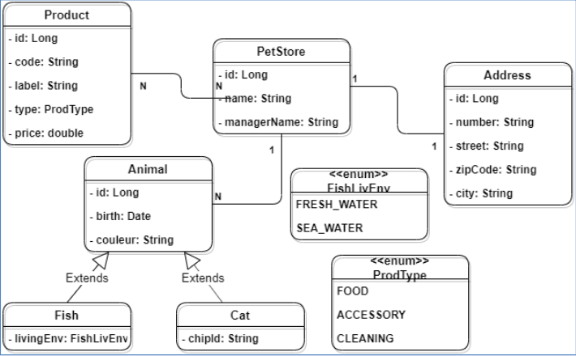

# PetStore - Spring Data JPA

Le projet est une application **Spring Boot** utilisant **Spring Data** et **Hibernate** pour créer la base de données d'une animalerie.

## Objectifs

- Créer des entités via **JPA** et **Hibernate**.
- Mettre en place des relations complexes :
    - `OneToMany` (1, N)
    - `ManyToMany` (N, N)
    - `OneToOne` (1, 1)
- Gérer les relations entre les tables via les annotations :
    - `@JoinColumn`
    - `@JoinTable`
    - `@DiscriminatorColumn`
    - `@DiscriminatorValue`

Le modèle de données utilisé est un modèle **MERISE**.



## Avant de commencer

1. Ouvrez le fichier `application.properties` et modifiez la ligne suivante :
    ```properties
    spring.datasource.driver-class-name=org.mariadb.jdbc.Driver
    ```
   Vous pouvez utiliser **Mariadb**, **Postgresql**, **SQLServer** ou **Oracle**.

2. Ensuite, modifiez l'URL de connexion en fonction de votre base de données. Par exemple :
    ```properties
    spring.datasource.url=jdbc:mariadb://localhost:3306/petstore
    ```
   
## Prérequis de Connaissances

Avant de commencer ce projet, il est nécessaire d'avoir des connaissances dans les domaines suivants :
1. Programmation Orientée Objet (POO)
2. SQL
3. Java
4. Spring Boot 3
5. Hibernate

## Technologies Utilisées

- **Java 22**
- **Spring Boot 3**
- **Hibernate**
- **MariaDB**
- **Maven**

## Fait par

**Eliazid Boulaamail**  
Au sein de **L'EPSI**
